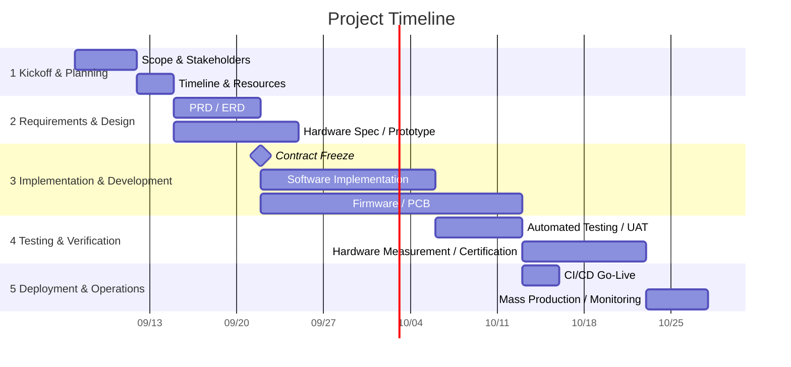

# Project Timeline

> Uses Mermaid gantt: version-controllable and renderable by tools.

```mermaid
gantt
    title Project Timeline
    dateFormat  YYYY-MM-DD
    axisFormat  %m/%d

    section 1 Kickoff & Planning
    Scope & Stakeholders      :a1, 2026-09-07, 5d
    Timeline & Resources      :a2, after a1, 3d

    section 2 Requirements & Design
    PRD / ERD                 :b1, after a2, 7d
    Hardware Spec / Prototype :b2, after a2, 10d

    section 3 Implementation & Development
    Contract Freeze           :milestone, m1, after b1, 0d
    Software Implementation   :c1, after m1, 14d
    Firmware / PCB            :c2, after m1, 21d

    section 4 Testing & Verification
    Automated Testing / UAT   :d1, after c1, 7d
    Hardware Measurement / Certification :d2, after c2, 10d

    section 5 Deployment & Operations
    CI/CD Go-Live             :e1, after d1, 3d
    Mass Production / Monitoring :e2, after d2, 5d
```
