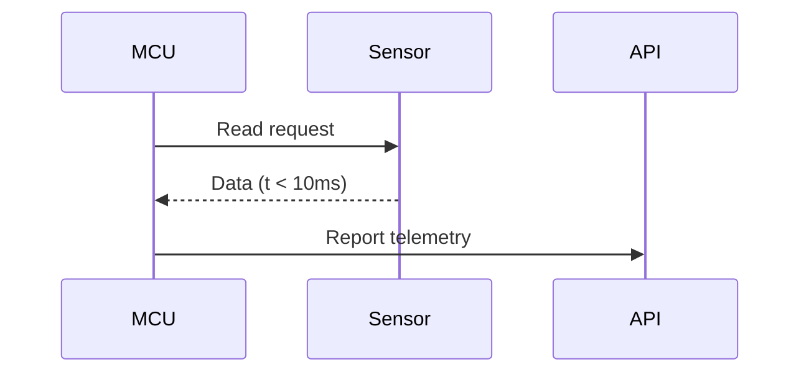

# Timing Spec

> Describes communication timing, clocks, and latency requirements. The firmware's delay/timeout settings must conform to this spec.
>
> ⚠️ Example — delete when starting real content: the values in the table (I2C 400kHz, UART 115200, etc.) are format demonstrations; replace them.

## Communication Timing
| Signal/Bus | Parameter | Min | Typical | Max | Unit | Description |
|------------|-----------|-----|---------|-----|------|-------------|
| I2C | SCL frequency |  | 400 |  | kHz |  |
| UART | Baud |  | 115200 |  | bps |  |

## Key Timing Requirements
- Boot to ready (boot ready): < ___ ms (corresponds to NFR-___)
- Sensor sampling period: ___ ms
- Watchdog timeout: ___ ms

## Timing Diagram (optional)

