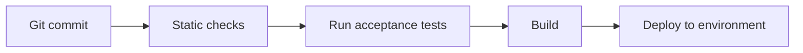

# CI/CD Pipeline

## Software Pipeline

| Stage | Tool | Pass condition |
|------|------|----------|
| Checks |  |  |
| Tests |  | all acceptance tests pass |
| Deploy |  |  |

## Firmware/Hardware Pipeline
- Firmware build: ___ (compile, produce .hex/.bin)
- Flashing and smoke test: ___
- Hardware acceptance: follow the `acceptance/hardware/` procedures

## Environments
| Environment | Purpose | URL/Location |
|------|------|-----------|
| dev |  |  |
| staging |  |  |
| prod |  |  |
