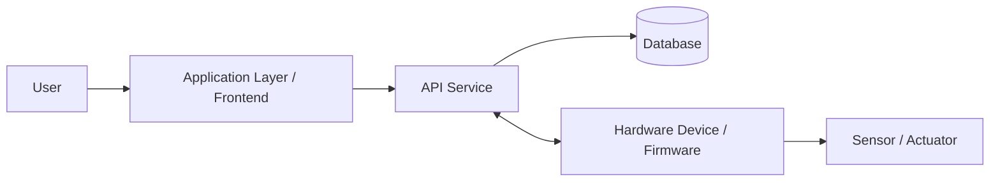
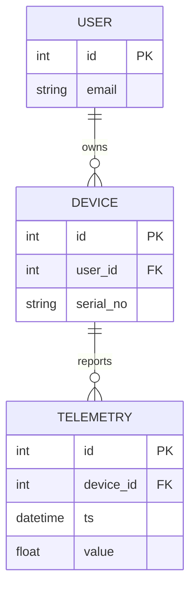

# Engineering Requirements Document (ERD) — Structure Layer

> Turns the PRD's intent into technical structure. The content here must be fully consistent with `contracts/`.
>
> ⚠️ Example — delete when starting real content: the architecture diagram, USER/DEVICE/TELEMETRY, tech stack selection, etc. in this file are format demonstrations; replace them when starting a real project.

## 1. System Architecture Overview

## 2. Hardware/Software Boundary (Interface Contract)
> How do software and hardware communicate? This is where integration projects most easily go wrong, so be sure to document it clearly.

| Interface | Direction | Protocol | Data Format | Contract File |
|-----------|-----------|----------|-------------|---------------|
| e.g. Device status report | HW → API | MQTT/HTTP/UART | JSON/binary | `contracts/api.openapi.yaml` |
| e.g. Firmware command dispatch | API → HW | same as above | same as above |  |

## 3. Data Model (ER Diagram)

> ⚠️ This ER diagram is **for reading guidance / visualization only**. The single source of truth is
> **`contracts/data-schema.sql`**; if the diagram and the schema conflict, the schema always prevails. When generating code, read only `contracts/`.

## 4. Tech Stack Selection (Corresponding ADRs)
| Item | Choice | Decision Record |
|------|--------|-----------------|
| Backend Language/Framework |  | ADR-0002 |
| Database |  |  |
| MCU / Hardware Platform |  |  |
| Communication Protocol |  |  |

## 5. Requirements Traceability
| PRD Requirement | Corresponding Module/Component | Corresponding Contract | Corresponding Test |
|-----------------|--------------------------------|------------------------|--------------------|
| FR-001 |  |  | AC-001 |
