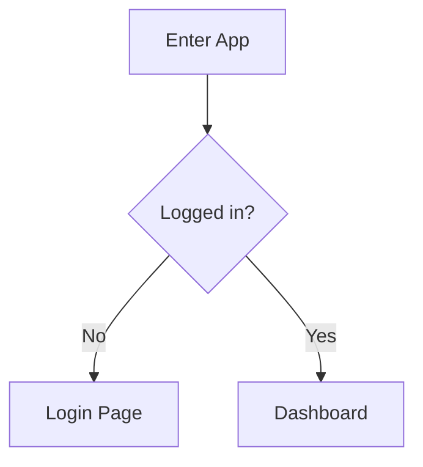

# UI/UX Prototype

Place wireframes, prototype links, and interaction descriptions here. To keep everything version-controllable and reconstructable, we recommend:

- **Low-fidelity wireframes**: describe the layout directly here using Mermaid or ASCII.
- **High-fidelity designs**: place the Figma link, and describe the key screens, states, and flows in text here, so that "the UI can be reconstructed from the text even without Figma access."

## Screen List
| Screen ID | Name | Corresponding Requirement | Description/Link |
|-----------|------|---------------------------|------------------|
| UI-001 | Home | FR-001 |  |

## Key Flows

